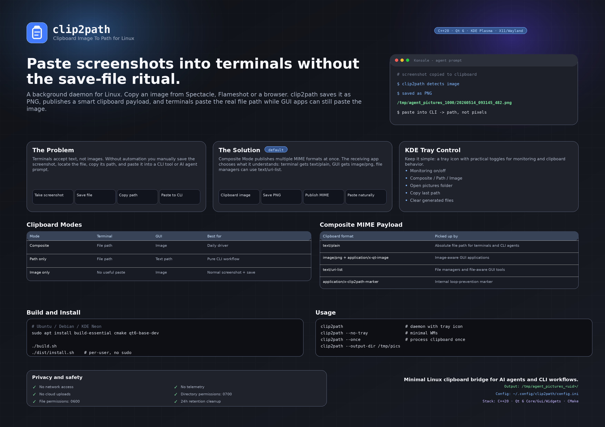
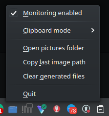

# clip2path



## Clipboard Image To Path for Linux

A background daemon for Linux that monitors the system clipboard. When you copy an image (screenshot, browser image, etc.), `clip2path` saves it to disk as a PNG and replaces the clipboard content so that pasting into a terminal yields the file path — while GUI applications can still receive the image itself.

## The Problem

Taking a screenshot and pasting it into a terminal, CLI tool, or AI agent prompt doesn't work — terminals accept text, not images. You end up manually saving the image to a file, copying the path, and then pasting it. That friction adds up.

`clip2path` automates this entirely:

```
You take a screenshot (Spectacle, Flameshot, etc.)
        ↓
Image lands in the system clipboard
        ↓
clip2path detects it → saves as PNG → puts file path in clipboard
        ↓
You paste into terminal → /tmp/agent_pictures_1000/20260514_093145_482.png
```

## The Solution: Composite Mode (Default)

The default **Composite** mode publishes multiple MIME formats into the clipboard simultaneously, letting the receiving application choose what it can handle:

| Clipboard paysheets | What gets it |
|---|---|
| `text/plain` | Absolute file path — picked up by terminals |
| `image/png` + `application/x-qt-image` | The image itself — picked up by GUI apps |
| `text/uri-list` | `file://` URI — picked up by file managers |
| `application/x-clip2path-marker` | Internal marker to prevent infinite loops |

**Result:** Paste into Konsole or VS Code terminal → you get the file path. Paste into Slack, Discord, GIMP, or a browser → the image pastes normally. No mode switching needed.

## Clipboard Modes

Three configurable modes, switchable from the tray menu:

| Mode | Terminal paste | GUI paste | Use case |
|---|---|---|---|
| **Composite** (default) | File path | Image | Daily driver — works everywhere |
| **Path only** | File path | Nothing | Pure CLI workflow, minimal interference |
| **Image only** | Nothing | Image | Normal screenshot behavior, save in background |

## Build

```bash
# Install dependencies (Ubuntu/Debian/KDE Neon)
sudo apt install build-essential cmake qt6-base-dev

# Build
./build.sh
```

This produces `dist/clip2path` — a single binary.

## Install (per-user, no sudo)

```bash
./dist/install.sh
```

The installer puts files under your home directory:

| Path | Purpose |
|---|---|
| `~/.local/bin/clip2path` | Binary |
| `~/.local/share/applications/clip2path.desktop` | KDE launcher entry |
| `~/.local/share/icons/hicolor/scalable/apps/clip2path.svg` | Icon |

Enable autostart during install and `clip2path` will start automatically when you log into KDE.

## Usage

```bash
clip2path                # Start daemon with tray icon (default)
clip2path --no-tray      # Run without tray icon (minimal window managers)
clip2path --once         # Process clipboard once and exit (testing)
clip2path --output-dir /tmp/pics  # Custom output directory
```

The tray icon (blue clipboard) sits in your KDE system tray with:

- **Monitoring enabled/disabled** — toggle on/off
- **Clipboard mode** — Composite / Path only / Image only
- **Open pictures folder** — opens `/tmp/agent_pictures_<uid>/` in your file manager
- **Copy last image path** — re-copies the most recent path to clipboard
- **Clear generated files** — removes only clip2path-generated files



## Configuration

`~/.config/clip2path/config.ini`:

```ini
[clipboard]
debounceMs=150
publishMode=composite      # composite | path-only | image-only

[storage]
outputDir=/tmp/agent_pictures_1000/
format=png

[retention]
enabled=true
maxAgeHours=24
maxFiles=500
maxTotalSizeMb=1024
```

## Privacy & Safety

- No network access, no telemetry, no cloud uploads
- Output directory permissions: `0700` (only your user can read)
- File permissions: `0600`
- Retention cleanup removes files older than 24 hours, keeping at most 500 files / 1 GB
- Original clipboard is preserved if image save fails

## Tech Stack

C++20, Qt 6 (Core, Gui, Widgets), CMake. Targets KDE Plasma on X11 and Wayland.
